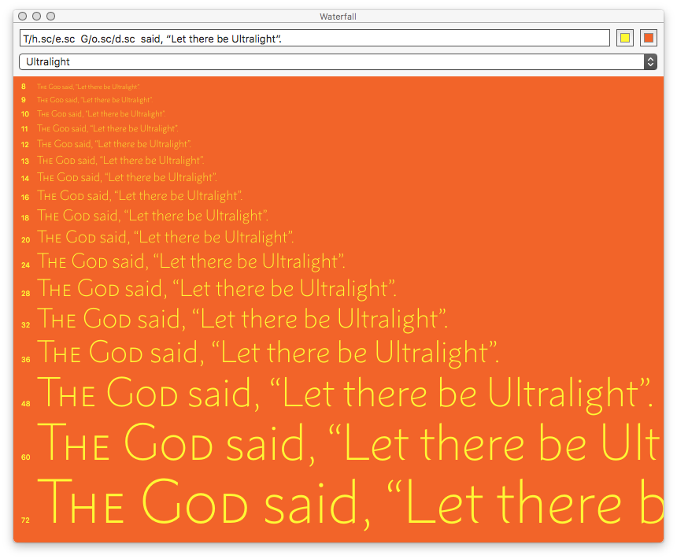

# Waterfall.glyphsPlugin

This is a plugin for the [Glyphs font editor](http://glyphsapp.com/) by Georg Seifert.
It is a window that shows the current font in different sizes.
After installation, it will add the menu item *Window > Waterfall*.
You can set a keyboard shortcut in System Preferences.
Massive thanks to [Mark2Mark](https://github.com/Mark2Mark) for the help!

### Installation

You can use Glyphs' Plugin Manager and let it handle everything. If you want it the hard way...

1. Download the complete ZIP file and unpack it, or clone the repository.
2. Double click the .glyphsReporter file. Confirm the dialog that appears in Glyphs.
3. Restart Glyphs.

The plugin will appear in Window > Waterfall.

### License

Copyright 2017 Toshi Omagari (@tosche_e).
Based on sample codes by Rainer Erich Scheichelbauer (@mekkablue).

Licensed under the Apache License, Version 2.0 (the "License");
you may not use this file except in compliance with the License.
You may obtain a copy of the License at

http://www.apache.org/licenses/LICENSE-2.0

See the License file included in this repository for further details.
